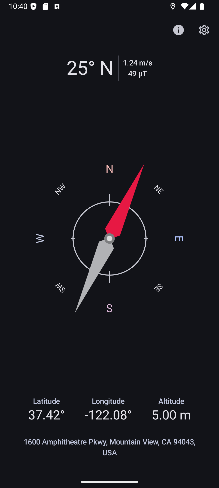
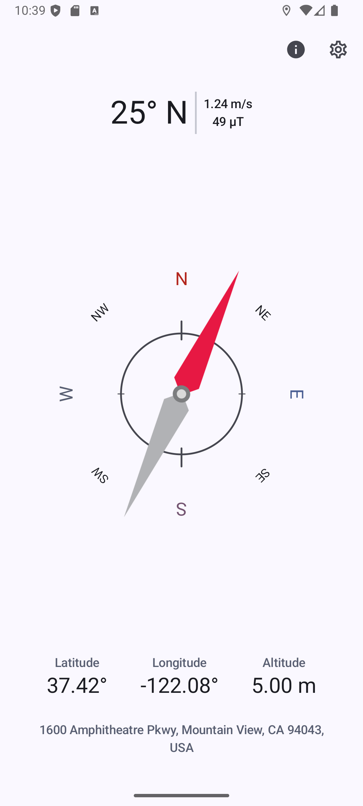

# Compass

A compass app for Android that displays the azimuth, latitude, longitude, altitude, current heading, speed, and magnetic field strength.

## Features

*   **Compass Heading:** Shows the current direction of the device.
*   **Location:** Displays the latitude, longitude, and altitude.
*   **Speed:** Shows the current speed of the device.
*   **Magnetic Field:** Displays the magnetic field strength.

## Technologies Used

*   **Jetpack Compose:** For building the UI.
*   **Kotlin Coroutines and Flow:** For asynchronous operations.
*   **Google Play Services:** For location services.

## Building the Project

To build the project, you will need Android Studio and the Android SDK. You can then clone the repository and open it in Android Studio.

## Future Todos

- [ ] **Set Map Markers:** Allow users to input coordinates for a destination and have the compass point towards that map marker.
